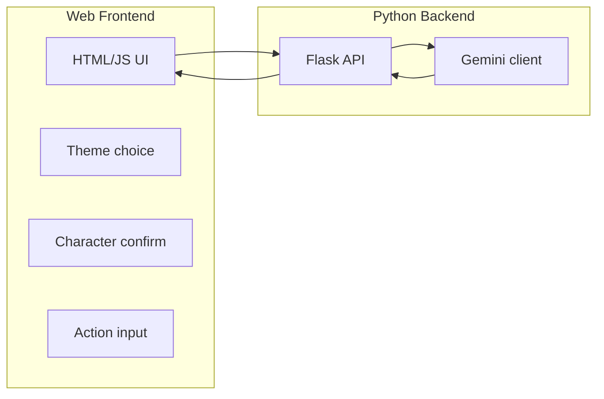

# Interactive AI Storytelling Web Game

## Architecture

- **Backend**: Flask app serving a single page and a JSON API that forwards prompts to Gemini and returns text.
- **Frontend**: One HTML page with minimal CSS/JS: forms for theme, character confirmation, and action input; area to display story text.
- **AI**: Google Gemini via `google-genai` SDK; API key from `GEMINI_API_KEY` env var.

## Game flow

1. **Theme selection** – User chooses one of: Fantasy, Science Fiction, Mystery, Adventure (or "Other" with custom text).
2. **Character suggestion** – Backend calls Gemini with the chosen theme and asks for a character name and short personality (e.g. "Eira, a cautious herbalist"). Response shown to user.
3. **Character confirm/edit** – User accepts or types changes (name and/or personality). Stored for the rest of the session.
4. **Opening scene** – Backend calls Gemini to generate a short "tranquil environment" then a "disruption" (2 paragraphs). Display in the story area.
5. **Action loop** – User types an action (e.g. "investigate the noise"). Backend sends current story state + character + user action to Gemini; Gemini returns the next narrative chunk. Append to story and show; repeat.

Session state (theme, character, story so far) can live in the frontend (e.g. JS variables) and be sent with each request, so no database is required.

## Project structure

- **app.py** – Flask app: serve `index.html`, and 3 endpoints:
  - `POST /api/suggest-character` – body: `{ "theme": "fantasy" }` → returns `{ "name": "...", "personality": "..." }`.
  - `POST /api/start-story` – body: `{ "theme", "characterName", "characterPersonality" }` → returns opening (tranquil + disruption).
  - `POST /api/continue-story` – body: `{ "theme", "characterName", "characterPersonality", "storySoFar", "userAction" }` → returns next narrative segment.
- **templates/index.html** – Single page: theme selector, character suggestion + confirm/edit fields, story div, action input + "Submit action" button. Optional: "New game" to reset.
- **requirements.txt** – `flask`, `google-genai` (and version pins).
- **.env.example** – `GEMINI_API_KEY=your_key_here` so users know what to set.

All Gemini calls use a shared function that builds a short system-style prompt (e.g. "You are a narrative engine for an interactive story. Genre: …") plus the request-specific prompt and then calls `client.models.generate_content(...)`. Use a fixed model name (e.g. `gemini-2.5-flash`).

## Implementation details

- **Prompts** (concise):
  - Character: "Given genre X, suggest a single protagonist: full name and one sentence personality. Reply in JSON: {name: ..., personality: ...}."
  - Opening: "Genre X. Character: name, personality. Write 2 short paragraphs: (1) a tranquil setting, (2) a sudden disruption. No dialogue from the narrator; set the scene only."
  - Continue: "Genre X. Character: name, personality. Story so far: [story]. Player action: [action]. Write the next narrative segment (2–4 sentences) that results from this action. Then briefly describe the new situation so the player can choose another action."
- **Error handling**: If Gemini is unavailable or returns an error, return a JSON error and show a friendly message in the UI (e.g. "Story engine is busy; try again"). When `app.debug` is True, the response includes a `detail` field with the underlying error for debugging.
- **Security**: No secrets in frontend; API key only in backend env. No need for user auth for an in-browser, single-session game.

## How to start

1. Install deps: `pip install -r requirements.txt`.
2. Copy `.env.example` to `.env` and set `GEMINI_API_KEY` (get a key from [Google AI Studio](https://aistudio.google.com/app/apikey)).
3. Run with `flask run` or `python app.py` and open the browser to the shown URL.

No database or auth is required for the first version; optional future enhancements could add save/load or multiple sessions.
